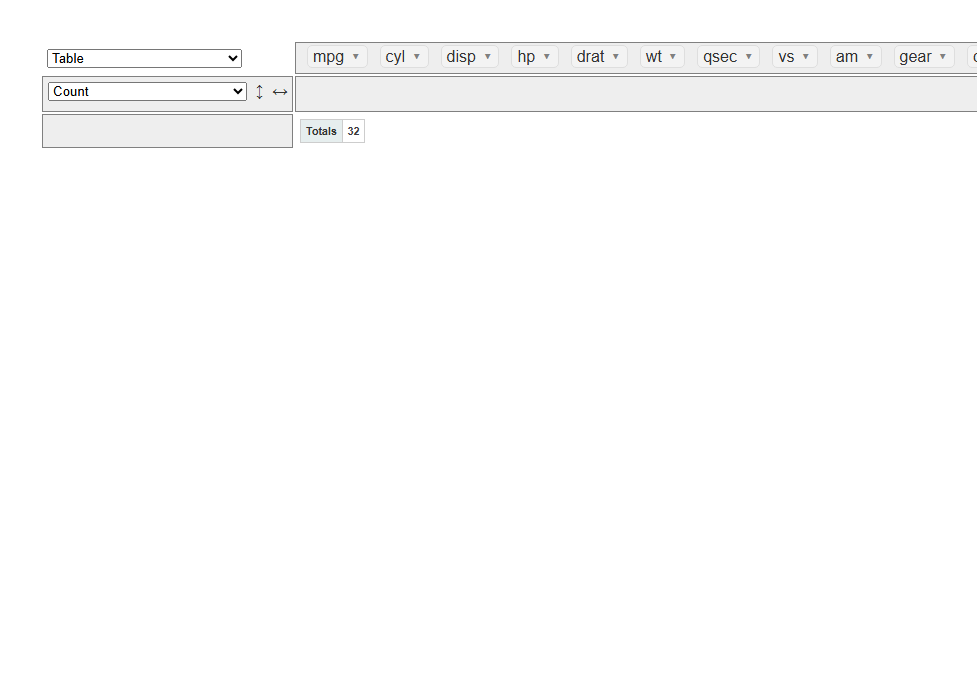
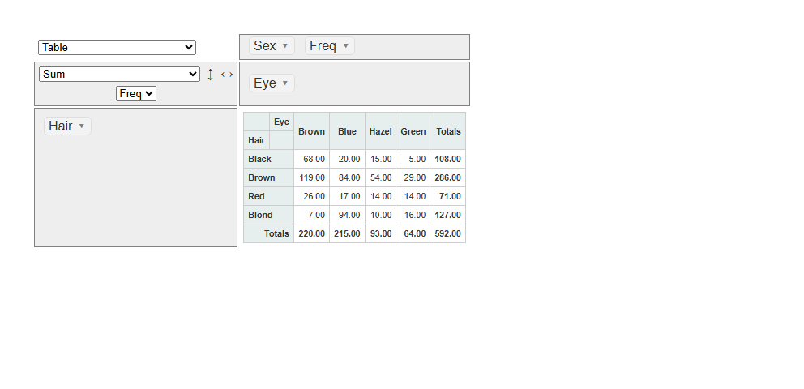
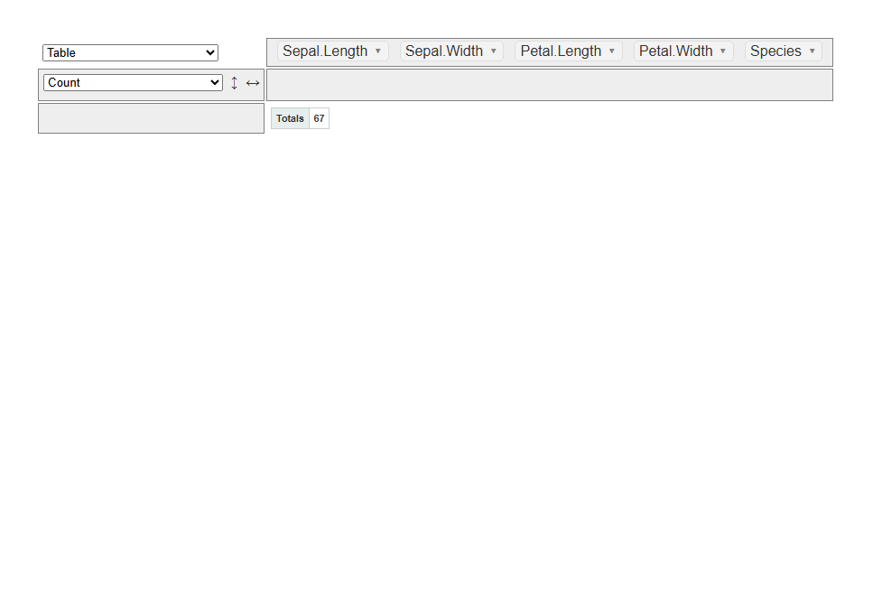

<!-- README.md is generated from README.Rmd. Please edit that file -->

# rpivotTable: pivottable for R

<!-- badges: start -->

[](https://lifecycle.r-lib.org/articles/stages.html#stable)
[](https://github.com/IDEMSInternational/rpivotTable/actions/workflows/R-CMD-check.yaml)
<!-- badges: end -->

This package is derived from Enzo Martoglio’s original
[rpivotTable](https://github.com/smartinsightsfromdata/rpivotTable),
released under the MIT license.

The rpivotTable package is an R [htmlwidget](http://htmlwidgets.org)
visualization library built around the Javascript
[pivottable](http://nicolas.kruchten.com/pivottable/examples/) library.

PivotTable.js is a Javascript Pivot Table library with drag’n’drop
functionality built on top of jQuery/jQueryUI and written in
CoffeeScript (then compiled to JavaScript) by Nicolas Kruchten at
Datacratic. It is available under an MIT license

## Installation

The rpivotTable package depends on
[htmlwidgets](https://github.com/ramnathv/htmlwidgets) package so you
need to install both packages. You can do this using the **pak** package
as follows:

``` r
pak::pak(c("ramnathv/htmlwidgets", "IDEMSInternational/rpivotTable"))
#> ℹ Loading metadata database✔ Loading metadata database ... done
#>  
#> → Will install 12 packages.
#> → Will update 1 package.
#> → Will download 9 CRAN packages (3.84 MB), cached: 2 (1.68 MB).
#> → Will download 2 packages with unknown size.
#> + base64enc           0.1-6      
#> + digest              0.6.39     [dl] (227.52 kB)
#> + evaluate            1.0.5      [dl] (105.37 kB)
#> + fastmap             1.2.0      [dl] (135.36 kB)
#> + highr               0.12       [dl] (44.57 kB)
#> + htmltools           0.5.9      [dl] (365.04 kB)
#> + htmlwidgets         1.6.4.9000 [bld][cmp][dl] (GitHub: 08ad901)
#> + jsonlite            2.0.0      [dl] (1.11 MB)
#> + knitr               1.51       [dl] (1.11 MB)
#> + rlang               1.2.0      
#> + rpivotTable 0.4.0 → 0.4.0      [bld][cmp][dl] (GitHub: c22a781)
#> + xfun                0.57       [dl] (614.15 kB)
#> + yaml                2.3.12     [dl] (124.65 kB)
#> ℹ Getting 9 pkgs (3.84 MB) and 2 pkgs with unknown sizes, 2 (1.68 MB) cached
#> ✔ Cached copy of htmlwidgets 1.6.4.9000 (source) is the latest build
#> ✔ Cached copy of rpivotTable 0.4.0 (source) is the latest build
#> ✔ Cached copy of digest 0.6.39 (x86_64-w64-mingw32) is the latest build
#> ✔ Cached copy of evaluate 1.0.5 (i386+x86_64-w64-mingw32) is the latest build
#> ✔ Cached copy of fastmap 1.2.0 (x86_64-w64-mingw32) is the latest build
#> ✔ Cached copy of highr 0.12 (i386+x86_64-w64-mingw32) is the latest build
#> ✔ Cached copy of htmltools 0.5.9 (x86_64-w64-mingw32) is the latest build
#> ✔ Cached copy of jsonlite 2.0.0 (x86_64-w64-mingw32) is the latest build
#> ✔ Cached copy of knitr 1.51 (i386+x86_64-w64-mingw32) is the latest build
#> ✔ Cached copy of xfun 0.57 (x86_64-w64-mingw32) is the latest build
#> ✔ Cached copy of yaml 2.3.12 (x86_64-w64-mingw32) is the latest build
#> ✔ Installed htmlwidgets 1.6.4.9000 (github::ramnathv/htmlwidgets@08ad901) (282ms)
#> ✔ Installed base64enc 0.1-6  (236ms)
#> ✔ Installed digest 0.6.39  (256ms)
#> ✔ Installed evaluate 1.0.5  (292ms)
#> ✔ Installed fastmap 1.2.0  (322ms)
#> ✔ Installed highr 0.12  (382ms)
#> ✔ Installed htmltools 0.5.9  (447ms)
#> ✔ Installed jsonlite 2.0.0  (487ms)
#> ✔ Installed rlang 1.2.0  (125ms)
#> ✔ Installed xfun 0.57  (122ms)
#> ✔ Installed yaml 2.3.12  (133ms)
#> ✔ Installed knitr 1.51  (362ms)
#> ✔ Installed rpivotTable 0.4.0 (github::IDEMSInternational/rpivotTable@c22a781) (235ms)
#> ✔ 2 pkgs + 11 deps: upd 1, added 12 [8.2s]
```

## Usage

Call the package with

``` r
library(rpivotTable)  # No need to explicitly load htmlwidgets: this is done automatically
```

Just plug in your `data.frame` or `data.table` (e.g. dt) to
`rpivotTable()`.

It is as simple as this:

``` r
data(mtcars)
rpivotTable(mtcars)
```



The pivot table should appear in your RStudio Viewer or your browser of
choice.

Please refer to the examples and explanations
[here](https://github.com/nicolaskruchten/pivottable/wiki/Parameters).

`rpivotTable` parameters decide how the pivot table will look like the
firs time it is opened:

- `data` can be a `data.frame` or `data.table`. Nothing else is needed.
  If only the data is selected the pivot table opens with nothing on
  rows and columns (but you can at any time drag and drop any variable
  in rows or columns at your leasure)
- `rows` and `cols` allow the user to create a report, i.e. to indicate
  which element will be on rows and columns.
- `aggregatorName` indicates the type of aggregation. Options here are
  numerous: Count, Count Unique Values, List Unique Values, Sum, Integer
  Sum, Average, Sum over Sum, 80% Upper Bound, 80% Lower Bound, Sum as
  Fraction of Total, Sum as Fraction of Rows, Sum as Fraction of
  Columns, Count as Fraction of Total, Count as Fraction of Rows, Count
  as Fraction of Columns
- `vals` specifies the variable to use with `aggregatorName`.
- `renderers` dictates the type of graphic element used for display,
  like Table, Treemap etc.
- `sorters` allow to implement a javascript function to specify the ad
  hoc sorting of certain values. See vignette for an example. It is
  especially useful with time divisions like days of the week or months
  of the year (where the alphabetical order does not work)
- `subtotals` will allow to dynamically select / deselect subtotals

For example, to display a pivot table with frequency of colour
combinations of eyes and hair, you can specify:

``` r
data(HairEyeColor)
rpivotTable(data = HairEyeColor, rows = "Hair",cols="Eye", vals = "Freq", aggregatorName = "Sum", rendererName = "Table", width="100%", height="400px")
```



This will display a cross tab with the frequency of eyes by hair colour.
Dragging & dropping (slicing & dicing) categorical variables in rows and
columns changes the shape of the table.

If you want to include it as part of your `dplyr` / `magrittr` pipeline,
you can do that also:

``` r
library(dplyr)
#> Warning: package 'dplyr' was built under R version 4.4.3
#> 
#> Attaching package: 'dplyr'
#> The following objects are masked from 'package:stats':
#> 
#>     filter, lag
#> The following objects are masked from 'package:base':
#> 
#>     intersect, setdiff, setequal, union
iris %>%
  filter( Sepal.Width > 3 ) %>%
  rpivotTable()
```



## Latest news

Version 0.4.0: IDEMS International has forked and taken over as
maintainer. `rpivotTable()` now automatically sorts rows/columns for
factor variables by their factor level order (instead of
alphabetically), generating the `sorters` JavaScript itself from `data`
— pass your own `sorters` argument to override this default. Various
fixes for CRAN resubmission.
